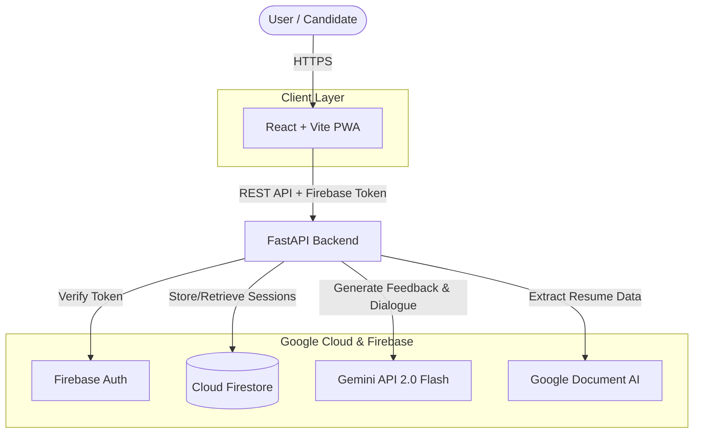
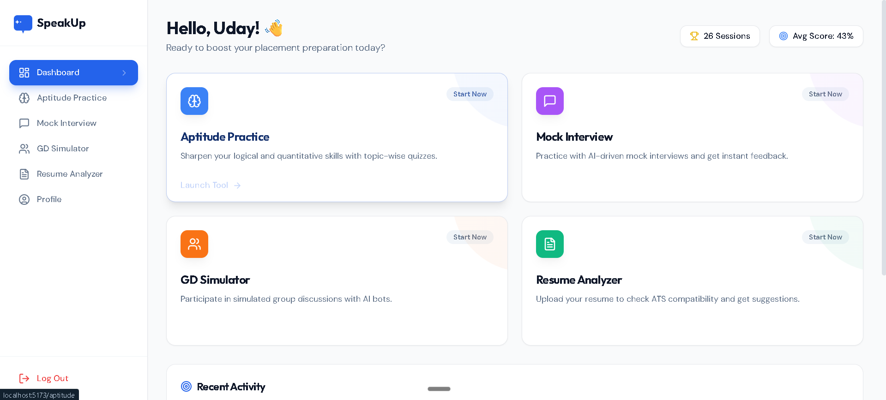
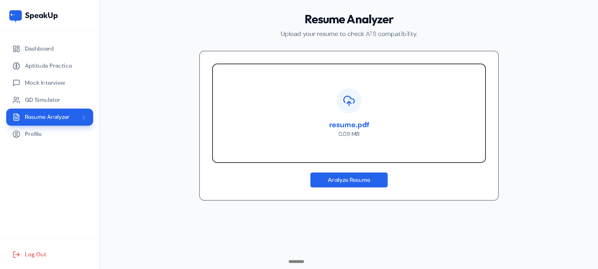
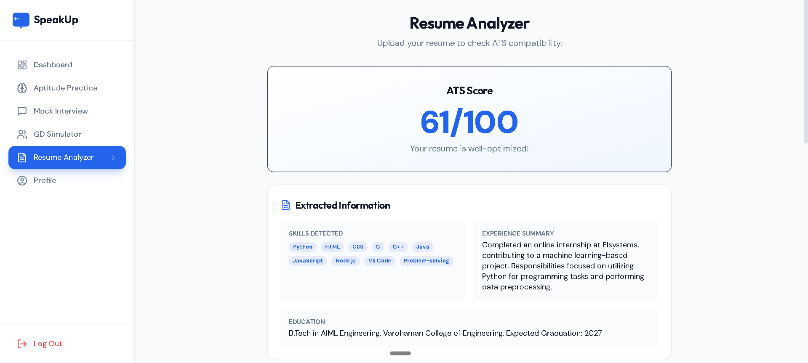
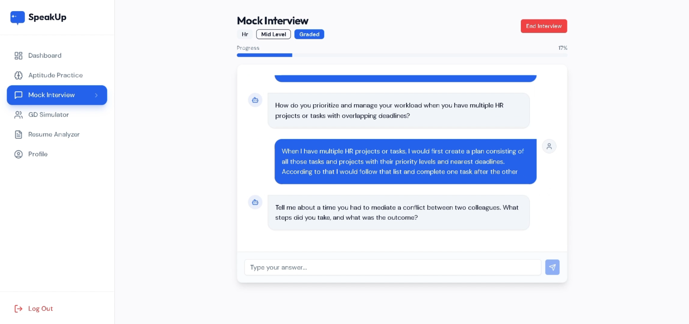
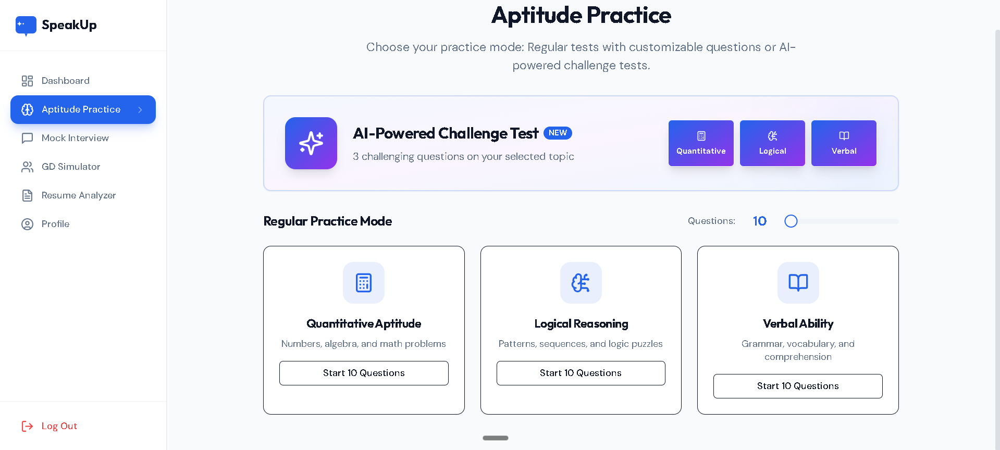

# SpeakUp - AI-Powered Placement Prep Platform 🚀

<div align="center">
  
  
  <br/>
  <h1>SpeakUp</h1>
  <p><b>Your AI-Powered Personal Career Coach</b></p>
  <p>
    <a href="#-google-technologies-used">Google Powered</a> •
    <a href="#-product-walkthrough">View Gallery</a> •
    <a href="#-getting-started">Get Started</a>
  </p>
</div>

---

## 📖 Project Description

**SpeakUp** is an advanced AI-powered placement preparation platform that democratizes career readiness. It solves the critical lack of personalized feedback for students by providing realistic, on-demand practice for technical interviews, group discussions, and aptitude tests.

Built with **Google Cloud technologies**, SpeakUp leverages **Gemini 2.0 Flash** for low-latency conversational coaching and **Document AI** for industrial-grade resume parsing. Securely powered by **Firebase Authentication** and **Firestore**, it bridges the gap between preparation and employment, offering instant, actionable feedback to help job seekers build confidence and land their dream jobs.

---

## 🏗️ Architecture

SpeakUp follows a modern, secure, and scalable architecture fully integrated with the Google Cloud ecosystem.



---

## 🛠️ Google Technologies Used

We utilize the full power of Google's AI and Cloud stack to deliver a premium experience.

| Feature               | Google Technology          | Purpose                                                                                                                 | Code Location                                              |
| :-------------------- | :------------------------- | :---------------------------------------------------------------------------------------------------------------------- | :--------------------------------------------------------- |
| **Conversational AI** | **Gemini API (2.0 Flash)** | Powers the Interviewer persona, Group Discussion bots, and Aptitude explanations. Selected for its reasoning and speed. | `backend/services/gemini_client.py`                        |
| **Resume Extraction** | **Document AI**            | Performs high-fidelity OCR to extract text from PDF resumes, handling complex layouts better than standard libraries.   | `backend/services/document_ai_ocr.py`                      |
| **Authentication**    | **Firebase Auth**          | Provides secure, serverless identity management and session handling.                                                   | `backend/firebase_config.py`                               |
| **Data Storage**      | **Cloud Firestore**        | Scalable NoSQL database for real-time syncing of session history, results, and user profiles.                           | `backend/firebase_config.py` (init) & `backend/services/*` |

---

## 📸 Product Walkthrough

### 1. Smart Dashboard

Your central command center tracking real-time progress across all modules.


### 2. Resume Analyzer (Powered by Document AI)

Upload your resume to get an instant ATS score and actionable improvement suggestions.

|                      Resume Upload                      |                         Analysis Result                          |
| :-----------------------------------------------------: | :--------------------------------------------------------------: |
|  |  |

### 3. AI Mock Interviewer

Experience realistic Technical and HR interviews with our AI avatar.


### 4. Group Discussion (GD) Simulator

Practice speaking up in a multi-bot environment (Alex, Sarah, Mike) with real-time turn-taking analysis.


### 5. Aptitude Arena

Test your skills with AI-generated questions and explanations.


---

## 🚀 Getting Started

### Prerequisites

- Node.js (v16+)
- Python (v3.9+)
- Google Cloud Project with Gemini & Document AI APIs enabled

### Installation

1.  **Clone the repository**

    ```bash
    git clone https://github.com/udaykumar0515/SpeakUp-TechSprint.git
    cd SpeakUp-TechSprint
    ```

2.  **Frontend Setup**

    ```bash
    cd SpeakUp-Frontend
    npm install
    npm run dev
    ```

3.  **Backend Setup**
    ```bash
    cd backend
    python -m venv venv
    source venv/bin/activate  # On Windows: venv\Scripts\activate
    pip install -r requirements.txt
    ```

### Environment Setup

Create a `.env` file in the `backend/` directory with your Google Cloud credentials:

```properties
# Google AI
GEMINI_API_KEY=your_gemini_api_key

# Google Document AI
DOCUMENTAI_PROJECT_ID=your_gcp_project_id
DOCUMENTAI_LOCATION=us
DOCUMENTAI_PROCESSOR_ID=your_processor_id
GOOGLE_APPLICATION_CREDENTIALS=path/to/service_account.json

# Firebase (if using Admin SDK)
FIREBASE_CREDENTIALS=path/to/firebase_credentials.json
```

4.  **Run the Backend**

    ```bash
    uvicorn main:app --reload --port 8000
    ```

5.  **Open the App**
    Visit `http://localhost:5173` in your browser.

    > **Demo Note**: You can use **any email** to sign up and test the platform immediately. No verification required.

---

## ✅ TechSprint Submission Checklist

- [x] **Public GitHub Repo**
- [x] **MVP Working** (Resume, Interview, GD, Aptitude)
- [x] **Architecture Diagram**
- [x] **Google Tech Integration** (Gemini, DocAI, Firebase)
- [ ] **Demo Video** (3 mins)
- [ ] **Pitch Deck**

---

<center>
  <sub>Built for the <b>Google TechSprint Hackathon</b></sub>
</center>
